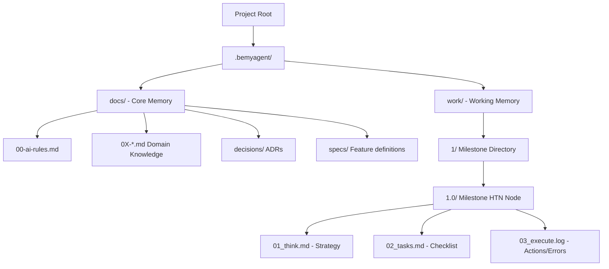

# Architecture: The BEMYAGENT Framework

The BEMYAGENT framework is not a software application but an **Information Architecture** and a **Workflow Protocol** designed for AI Agents.

## System Diagram (Directory Structure)

## Request Flow (The Developer-AI Interaction)
1. User provides a prompt or goal.
2. AI reads `.bemyagent/docs/00-ai-rules.md` (and lazy-loads relevant docs if needed).
3. AI scopes the work and creates/enters a `.bemyagent/work/X/X.Y/` directory.
4. AI runs `01_think.md` and PAUSES (Model Handoff point).
5. AI runs `02_tasks.md` and PAUSES.
6. AI executes the code and logs into `03_execute.log`.
7. AI updates `03-code-map.md` if any permanent structural changes were made.

## Component Responsibilities
- **`.bemyagent/docs/`**: Acts as the long-term memory for the AI. It MUST stay clean, concise, and heavily curated to avoid token limits.
- **`.bemyagent/work/`**: Acts as the short-term working memory. It stores the messy, step-by-step history so the agent doesn't need to keep it in its context window. It also serves as an audit trail for the human.
